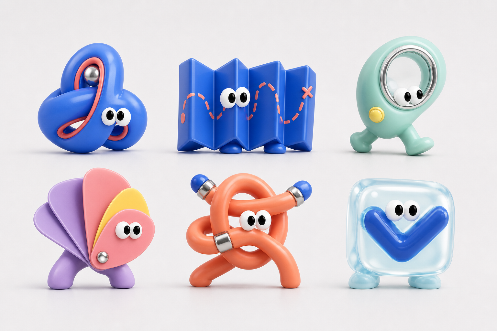

# Meld Mascot Family Design

**Date:** 2026-07-25
**Status:** Approved visual direction; ready for production planning

## 1. Summary

Meld will use a family of polished 3D object-creatures to give its general
brand and individual agents distinct, memorable faces. Every character is a
different object fused into a living sculptural form. The family relationship
comes from a shared face system, materials, proportions, lighting, and
art direction rather than from a shared body or color.

The characters should feel warm, clever, playful, and art-directed without
making Meld feel childish or unserious. They should resemble high-end
collectible designer toys photographed in a soft studio environment.

The approved directional board is:

This board establishes the character concepts and family language. It is a
directional reference, not the final production asset set.

## 2. Goals

- Give Meld one iconic general mascot without assigning it a literal meaning.
- Give Product, Research, Design, Engineering, and QA agents individually
  recognizable characters.
- Make each character readable as a small conversation avatar and expressive
  enough for product illustrations and marketing scenes.
- Create a system that can accept new agent characters without making the
  family visually inconsistent.
- Express each agent's role through a recognizable metaphor with an unexpected
  sculptural treatment.

## 3. Visual principles

### 3.1 Object-creatures, not decorated blobs

Each object's construction must form the character's body and silhouette. A
roadmap becomes folds, a cable becomes limbs and posture, and a translucent
inspection block contains the QA character's inner anatomy. Characters must
not look like generic round creatures holding, wearing, or standing behind a
role-specific prop.

### 3.2 One family, different silhouettes

Every agent has a completely different silhouette. Family resemblance comes
from:

- The same pair of oversized dimensional white oval eyes with glossy black
  pupils
- Rounded forms and carefully softened edges
- A consistent scale relationship between eyes, body, and feet
- Tactile 3D materials and controlled chrome accents
- Soft premium studio lighting, gentle contact shadows, and subtle reflections
- Restrained facial features and expressive eye direction

### 3.3 Warm and clever

The family should be immediately approachable, then reward a second look with
an intelligent visual metaphor or mechanically satisfying construction.
Personality comes from silhouette, gaze, material, posture, and movement rather
than from exaggerated facial expressions.

### 3.4 Color identifies the individual

The characters do not wear a blue uniform. Each agent receives a dominant
signature color, with at most two controlled accent colors. Cobalt remains a
recurring family anchor, while coral, orange, mint, lilac, pink, lemon, aqua,
and small chrome details create individual identities.

## 4. Initial character roster

The product should continue to display functional role labels such as
**Product Agent**. The character names below are working internal names and do
not need to appear in the UI.

### 4.1 General Meld mascot — The Spark

- **Purpose:** General Meld identity and the central member of the family
- **Form:** A compact, asymmetric sculpture made from three interlocking soft
  ribbons
- **Meaning:** Intentionally nonliteral; its job is to be iconic rather than
  explain a product function
- **Color:** Cobalt body, coral inner edge, and one restrained chrome detail
- **Personality:** Friendly, confident, quietly energetic
- **Avoid:** A recognizable star, flower, splat, animal, letter, or generic
  blob

### 4.2 Product Agent — The Fold

- **Form:** An accordion-fold roadmap whose folds create its body, feet, and
  posture
- **Color:** Rich blue with sparse coral route markings
- **Personality:** Composed, directional, and forward-looking
- **Role metaphor:** Organizes possible routes and helps the team choose a path
- **Signature motion:** Unfolds, refolds, and reroutes itself

### 4.3 Research Agent — The Lens

- **Form:** A distorted magnifying loop fused into a curious walking body
- **Color:** Mint green with a chrome rim and a small lemon accent
- **Personality:** Inquisitive, observant, and pleasantly nosy
- **Role metaphor:** Notices details and looks beyond the current frame
- **Signature motion:** Tilts, focuses, and briefly magnifies discoveries

### 4.4 Design Agent — The Swatch

- **Form:** A fan of flexible sculptural color leaves that forms one body
- **Color:** Lilac and warm pink with one lemon leaf
- **Personality:** Tasteful, expressive, and slightly dramatic
- **Role metaphor:** Explores alternatives and composes them into a coherent
  result
- **Signature motion:** Fans open, rearranges its leaves, and folds into new
  silhouettes
- **Avoid:** Reading as a flower or a skirt

### 4.5 Engineering Agent — The Link

- **Form:** One continuous soft cable tied into an impossible, mechanically
  satisfying body
- **Color:** Orange-coral cable with cobalt connector ends and small chrome
  joints
- **Personality:** Clever, energetic, and solution-oriented
- **Role metaphor:** Connects systems and turns structure into working behavior
- **Signature motion:** Untangles, reconnects, and tightens into a stable form
- **Avoid:** Robot anatomy or a normal humanoid body made from cables

### 4.6 QA Agent — The Check

- **Form:** A translucent inspection block with a bold check-shaped inner core
  integrated as anatomy
- **Color:** Pale aqua shell with a cobalt core
- **Personality:** Careful, skeptical, patient, and quietly satisfied
- **Role metaphor:** Inspects the whole object and confirms when it holds up
- **Signature motion:** The inner core rotates and clicks precisely into place
- **Avoid:** A checkmark merely printed on the surface

## 5. Face and expression system

Every character uses the same eye construction:

- Two large dimensional white ovals
- Glossy black pupils with the same highlight treatment
- No eyebrows
- No mouth by default; a tiny crease is allowed only when an expression cannot
  be communicated through eyes and posture

The initial expression set is:

- Neutral
- Curious
- Focused
- Pleased
- Concerned
- Celebratory

Expressions should remain restrained. Eye direction, pupil position, body
compression, tilt, and role-specific movement do most of the acting.

## 6. Materials, lighting, and color

The family may use soft-touch rubber, glossy molded plastic, translucent jelly,
pearlescent plastic, and restrained polished chrome. Each character should have
one primary material and no more than two secondary material treatments.

Lighting should resemble premium studio product photography:

- Very pale warm-gray or context-appropriate neutral backgrounds
- Broad, soft key light
- Gentle floor contact shadows
- Subtle reflections without a mirror-like floor
- Crisp forms with a slight dreamy softness
- No busy scenery in core product assets

Color is assigned per character and must remain stable across asset variants.
Exact production color values will be selected against Meld's final brand
palette during asset production. Color alone must never communicate agent role
or product state.

## 7. Asset tiers

Every approved character requires three coordinated asset tiers.

### 7.1 Avatar

- Optimized for approximately 24–48 px display
- Cropped around the eyes and signature silhouette
- Uncluttered face area
- Strong contrast against light and dark UI surfaces
- Recognizable without a text label, although the UI still provides one

### 7.2 Product illustration

- Full-body character
- One clear pose and emotion
- Transparent or pale neutral background
- Suitable for onboarding, empty states, task progress, errors, and completion
  moments

### 7.3 Marketing scene

- Higher-detail poses and materials
- Multiple characters may interact
- Props and environments are allowed when they support a specific story
- The core silhouette, eye construction, signature color, and material identity
  must remain unchanged

## 8. Product behavior and accessibility

- Agent role labels remain visible or available to assistive technology.
- Neither character identity nor color replaces status text, icons, or labels.
- Avatars require meaningful accessible names in interactive contexts and
  empty alternative text when they are purely decorative.
- Motion must respect reduced-motion preferences.
- Character animation must not obscure task status or delay product actions.
- Dark-mode variants should change background, rim light, and shadow treatment
  rather than recolor the character.

## 9. Production deliverables

The initial production package should contain:

- One final model and material specification for each of the six characters
- One neutral avatar and the six-expression avatar set per character
- One neutral full-body product illustration per character
- At least one role-specific action pose per agent
- One group family portrait
- Light- and dark-surface render tests
- Raster exports at the sizes required by the product
- A source format capable of producing consistent new poses and resolutions
- A short character bible documenting proportions, eye construction, colors,
  materials, camera, lighting, and prohibited variations

Production should use a consistent controllable 3D source workflow rather than
independently generating every final pose. Generated imagery may be used for
exploration, but final assets need repeatable character geometry and art
direction.

## 10. Acceptance criteria

The family is ready for product use when:

1. All six characters are distinguishable by silhouette in grayscale.
2. Each avatar remains recognizable at the smallest intended product size.
3. Every character uses the same eye construction and compatible rendering.
4. A viewer can associate each agent character with its role after seeing the
   label once.
5. Light- and dark-surface variants meet product contrast requirements.
6. The family feels coherent when shown together despite using different
   colors, objects, and materials.
7. A new character can be designed from this specification without copying an
   existing body.
8. Role and status remain understandable when mascot imagery is absent.

## 11. Non-goals

- Replacing the Meld wordmark or existing product mark
- Making mascots the only way users identify agents
- Creating human, animal, or robot characters
- Giving every agent the same base body
- Making the characters predominantly blue
- Finalizing working character names as product-facing copy
- Producing the final 3D models or application integration in this design phase
